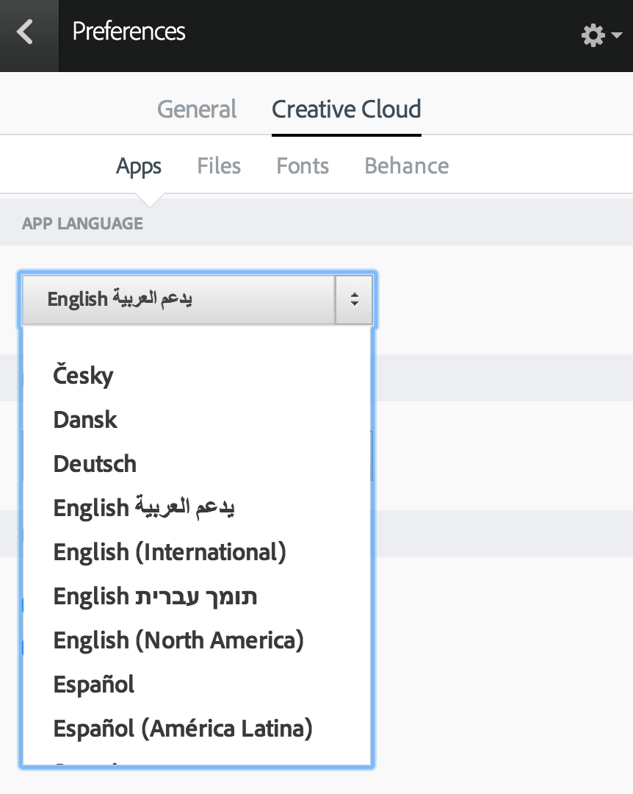
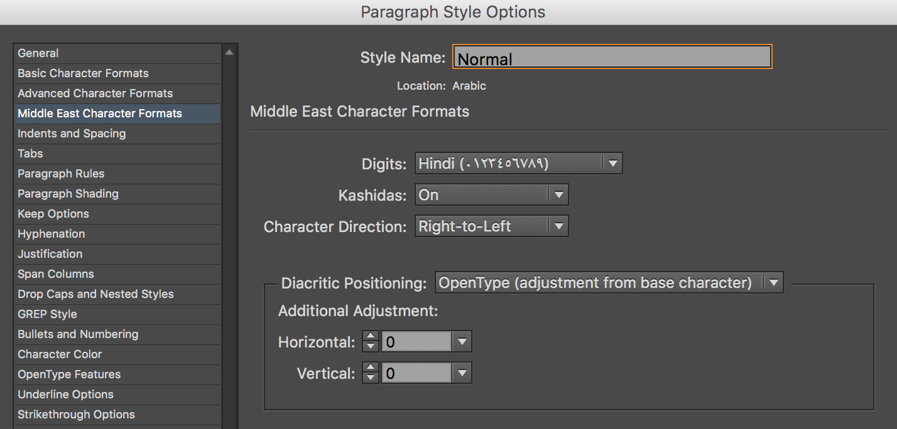
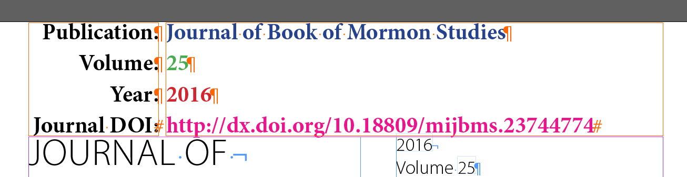
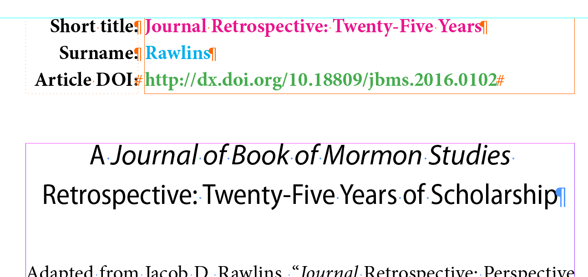
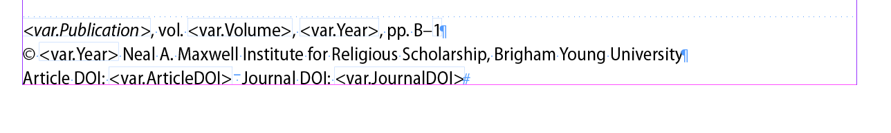
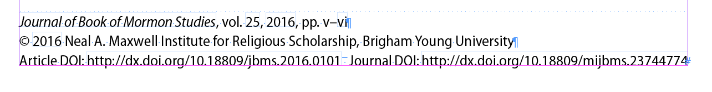
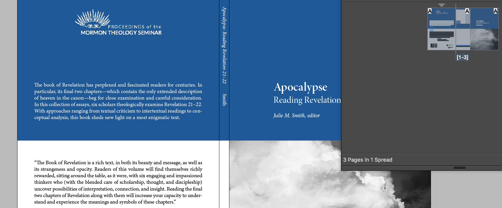
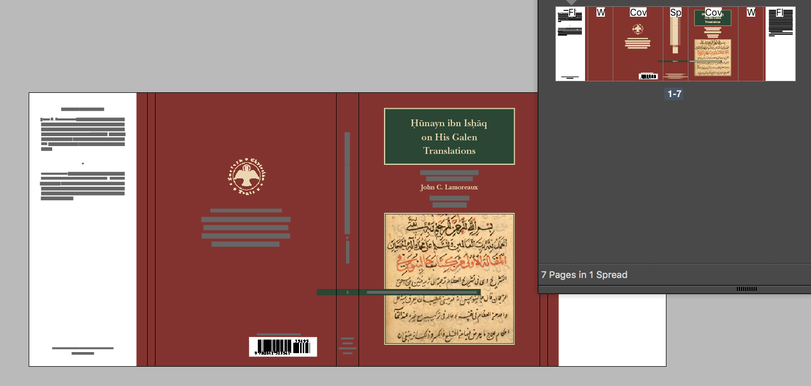

# Maxwell Institute typesetting

[Andrew Heiss](https://www.andrewheiss.com) | June 3, 2016

## Contents

- [tl;dr](#tldr)
- [A brief history of handling Arabic at the Maxwell Institute](#a-brief-history-of-handling-arabic-at-the-maxwell-institute)
    - [Word processing](#word-processing)
    - [Typesetting](#typesetting)
- [Typesetting tips and tricks](#typesetting-tips-and-tricks)
    - [Communication, shared files, and archiving](#communication-shared-files-and-archiving)
    - [Fonts](#fonts)
    - [Styles on everything](#styles-on-everything)
    - [Find and replace](#find-and-replace)
    - [Copyfitting](#copyfitting)
    - [Text variables and automation](#text-variables-and-automation)
    - [Extracting footnotes](#extracting-footnotes)
- [Miscellaneous headache\-inducing issues](#miscellaneous-headache-inducing-issues)
    - [Character direction](#character-direction)
    - [Diacritics](#diacritics)
- [Covers](#covers)
    - [Barcodes](#barcodes)
- [Converting to HTML](#converting-to-html)
    - [General HTML template](#general-html-template)


## tl;dr

- Use Mellel, Pages, LibreOffice, and/or Word 2015 to deal with Arabic and Hebrew manuscripts
- Typeset manuscripts with InDesign Creative Cloud after changing your CC app language preferences to "English يعدم العربية"
- Use paragraph and character styles like they're going out of it
- Use text variables and hidden layers to automate running and repeated text
- Create covers using faux pages
- Convert final books to HTML with a Python script


## A brief history of handling Arabic at the Maxwell Institute

### Word processing

In the dark ages of OS X, there was no Apple- or Microsoft-created program to type Arabic text. Third-party developers created specialized word processors like [Nisus Writer](https://www.nisus.com/pro/) and [Mellel](http://www.mellel.com/) to solve this, but neither program used (or still uses) standard file formats, so documents written in Nisus or Mellel are typically locked into those formats unless exported as RTF or something else. Though both programs support character and paragraph styles, those styles are lost and converted to local formatting when exporting as RTF, so no styles are carried over when documents are placed in InDesign.

In the early years of METI, manuscripts were typed and edited in both Nisus and Mellel programs until Apple added RTL support to Pages, which has decent support for exporting documents (with styles!) to `.docx` (for placing in InDesign).

In 2010, METI started using [LibreOffice](https://www.libreoffice.org/) (a fork of OpenOffice) for many of its Arabic documents, since it has RTL support and has better support for styles (it also uses a standard document format, `.odt`. In 2016 (!!!) Microsoft *finally* added RTL support to Word 2015 on OS X, so now it is possible to just stick with Word all the time. (Not that Word is that great—it's typically quite horrible. But it's the de facto industry standard, and InDesign was designed with `.docx` files in mind). 

Regardless, authors and editors today use Mellel, Pages, LibreOffice, and Word for Arabic and Hebrew manuscripts, so you need to have access to all these programs.

### Typesetting

In the dark ages of Arabic typesetting, InDesign did not support right-to-left (RTL) languages. Winsoft, a third-party vendor, created a licensed version of InDesign called InDesign ME, and released it in parallel with Creative Suite CS1–CS5.5. InDesign ME was expensive and had a dumb licensing system that didn't work well.

Additionally, BYU used a special plugin for InDesign ME called Tasmeem, which provided a complicated (and very nice!) typesetting engine for Arabic text ([Saudi Aramco's magazine even had a cover story dedicated to it in 2007](http://archive.aramcoworld.com/issue/200704/keyboard.calligraphy.htm)). [Thomas Milo](http://www.decotype.com/) designed several incredibly complicated fonts—including a Naskh that BYU used for several years—that were created to take full advantage of Tasmeem's powers. With Tasmeem, it was possible to move, color, and style diacritics manually, control kashida lengths dynamically (for well-justified poetry, for example), and insert elaborate Qurʾanic glyphs. 

But Tasmeem was required to use Milo's fonts, and InDesign ME was required to use Tasmeem, and all of that cost a lot of money and was a constant headache. And Milo's fonts were locked into Tasmeem and couldn't be used in Illustrator, Photoshop, or any other program. It was a mess.

From at least CS2, it was always possible to use RTL languages in the standard, non-ME InDesign [using manual hacks](https://www.andrewheiss.com/blog/2007/09/17/using-arabic-in-indesign-without-indesign-me/), but starting with InDesign CS5, Adobe included built-in RTL typesetting support (that [had to be enabled in a hacky way](https://www.andrewheiss.com/blog/2011/06/24/using-arabic-in-indesign-cs5-without-indesign-me/)) through its "World Ready Paragraph Composer." With the transition from Creative Suite to Creative Cloud (CC), Adobe made its RTL support official (and even included Arabic fonts with the base CC installation). 

The RTL typesetting engine should be enabled in any version of InDesign CC (so you can open an InDesign document with typeset Arabic wherever), but switching your language settings to use "English يعدم العربية" in Creative Cloud app preferences enables the full range of RTL options, allowing you to create special RTL text frames with the ME type tool and work with "Middle East Character Formats" in paragraph and character styles.

**English with Arabic support preference**



**Middle East Character Format options**



With this new development, Winsoft has ended development on InDesign ME, stopping at CS5.5. Tasmeem is still available, and is still the only way to use Thomas Milo's nicely designed fonts, but it's still expensive. Instead of using Milo's fancy Naskh, METI now uses [Zuhair Albazi Naskh](http://www.omar-type.com/zuhair_albazi_naskh.html), created by a designer in Pakistan who is super friendly and responsive. The font itself is a delight to use, and while InDesign CC doesn't have as many typographic options as Tasmeem did, the font has a nearly complete collection of stylistic sets that let you change all kinds of tiny details (see [page 10 of the font brochure for examples](http://www.omar-type.com/brochures/Brochure%20of%20Zuhair%20Albazi%20Naskh%20Font.pdf)).


## Typesetting tips and tricks

The best way to see how the METI and Maxwell Institute books are set up is to look at a few recent ones (like  Stroumsa's *Twenty Chapters* or Lamoreaux's *Ḥunayn ibn Isḥāq* for METI and Rogers' *Let Your Hearts and Minds Expand* and *Journal of Book of Mormon Studies* 25 (2016) for Maxwell Institute books and journals).

Beyond poking around older books, here are a bunch of tips, tricks, and miscellaneous things I do/use/have discovered.

### Communication, shared files, and archiving

As of 2016, the Maxwell Institute uses Basecamp and Dropbox for storage and communication. There are two important folders in Dropbox:

- **METI Shared**: contains all ongoing METI work
- **Publications Archive**: contains all past Maxwell Institute work, as well as fonts and logos

When typesetting stuff, I typically would not put it in either of these folders until I was done, mostly so that in-progress files wouldn't get pushed out to everyone the folders are shared with (i.e. I didn't want every intermediate save to sync on everyone's computers). I kept projects in my own folders in the Maxwell Institute Dropbox and only moved them to the shared folders after they were packaged and done.

Both of these folders (*especially* Publications Archive) are huge. Super huge. It's an archive, after all.To avoid cluttering my computer with all these archives, I used Dropbox's selective sync settings (Dropbox \> Preferences \> Account \> Maxwell Institute \> Selective Sync \> Change Settings…) to only download `Publications Archive/Logos` and keep the rest of it off my computer. When archiving a finished project, I would change the selective sync settings to sync that project's archive to my computer, copy the InDesign package there, wait for it to upload, and then stop syncing the folder.

I did not use Dropbox to share intermediate drafts and proofs with the editorial team. Because each book team already communicates through Basecamp, I would upload everything there. I followed a simple naming system for drafts and proofs uploaded to Basecamp: `Book name (yyyy-mm-dd)`, with different variations like `Book name (yyyy-mm-dd, spreads)`, `Book name (yyyy-mm-dd, spreads, with bleed)`, etc.

### Fonts

- English
    - METI books use Baskerville JSU, which was custom-designed for METI and has almost every diacritic needed for transliteration. For unknown historical reasons, METI books sometimes use New Baskerville ITC Pro on the cover. This could/should be replaced with Baskerville JSU—I never got around to doing it.
    - Maxwell Institute books typically use Minion Pro or Yoga Pro (or anything else).
- General unicode
    - The infinity paper symbol on the copyright page (♾) uses [DejaVu Sans](http://dejavu-fonts.org/wiki/Main_Page)
    - While Baskerville JSU has almost all diacritics, Minion Pro does not. However, [Linux Libertine](http://www.linuxlibertine.org/) has a complete set of characters (even more than Baskerville JSU) and it is *nearly* identical to Minion Pro. Using Linux Libertine for strange diacritics in the middle of Minion text works just fine and the difference in the fonts is 99% negligible.
- Arabic
    - [Zuhair Albazi Naskh](http://www.omar-type.com/zuhair_albazi_naskh.html) is wonderful.
- Hebrew
    - New Peninim MT‭ (comes with OS X) works well for Hebrew, though any other good Hebrew font works well too
- Greek
    - Arno Pro has a great subset of Greek characters

### Styles on everything

Use styles. Use styles like your life depends on it. Make styles for literally everything. Instead of having one paragraph style for a block quote, have styles for:

- Block quote (standalone; indent)
- Block quote (standalone; no indent)
- Block quote (first)
- Block quote (middle)
- Block quote (last)
- Block quote (first; no indent)
- Block quote (middle; no indent)
- Block quote (last; no indent)

And so forth. It seems like overkill, but it really does make life far easier. 

Use character styles for everything that's not regular text. Create basic character styles like:

- Italic
- Bold
- Bold italic
- Superscript
- Subscript
- Small caps
  
Never use local formatting. Convert all local formatting to character styles and then override and kill all remaining local formatting. Make sure you convert *everything* you need to character styles before killing residual formatting—you don't want to lose all the italics or anything (it's horrible when that happens and you don't realize it until days later). As you copyfit, you'll inevitably add local formatting, fiddling with tracking and whatnot, but it's best to start copyfitting with a perfectly clean slate. 

Create character styles for languages that occasionally appear in English text (or English in Arabic/Hebrew text).

### Find and replace

Though many manuscripts come styles assigned to each paragraph, those styles don't always match with with whatever styles exist in the book template already. When placing a file, InDesign provides an option to map incoming styles to existing styles, but I skip this. Instead, after placing the file, I delete the imported styles manually one at a time, reassigning them to existing styles or creating new styles as needed. And some manuscripts don't use styles at all, which is fine—it just involves careful find/replace queries and manual care.

Few manuscripts include character styles for things generally left for local formatting (like bold and italic), so every text file I place goes through a standard set of find/replace queries:

| Type | Name of saved search        | Find what   | Change to   | Find format | Change format                         |
|------|-----------------------------|-------------|-------------|-------------|---------------------------------------|
| Text | • Bold to bold              | None        | None        | bold        | {Name of bold character style}        |
| Text | • Italic to italic          | None        | None        | italic      | {Name of italic character style}      |
| Text | • Small caps                | None        | None        | small caps  | {Name of small caps character style}  |
| Text | • Bold italic               | None        | None        | bold italic | {Name of bold italic character style} |
| Text | • Subscript                 | None        | None        | subscript   | {Name of subscript character style}   |
| Text | • Superscript               | None        | None        | superscript | {Name of superscript character style} |
| Text | • Hyphenating em-dash       | `—­`        | `—^-`       | None        | None                                  |
| Text | • Stacked quotes, opening   | `“‘`        | `“^|‘`      | None        | None                                  |
| Text | • Stacked quotes, closing   | `’”`        | `’^|”`      | None        | None                                  |
| Text | • Ellipses                  | ` . . .`    | `^S.^S.^S.` | None        | None                                  |
| GREP | Footnote + en space + space | `(~F\.)~> ` | `\t$1->`    | None        | None                                  |

The query for replacing footnotes might have to change depending on the manuscript. Ultimately, footnotes need to be structured like this (the tab + en space combination ensures that all notes are aligned on the period):

    {tab}1.{en space}Note text.

Clearing local formatting overrides for regular text is easy—select all the text in a story, click on the tiny menu in the top right corner of the "Paragraph Styles" panel, and select "Clear Overrides". **Importantly**, this does *not* clear overrides from footnotes. To do that, run a super simple find/replace query, with "Find Format" set to the footnote paragraph style and "Change Format" set to the same style. Replacing the style with itself clears local overrides.

Finding and replacing with regular expressions (or GREP) is incredibly powerful. If you're not familiar with them, play around with an interactive tutorial/tool at [RegExr](http://regexr.com/). I use [Patterns](http://krillapps.com/patterns/) all the time for testing search strings.

You can use more complicated GREP searches to look for text in other languages. However, these searches aren't perfect—they won't pick up on spaces between words or punctuation, so if you try to replace all Greek text with a Greek character style, you'll still have English spaces and punctuation (which is fine-ish for Greek, but can cause RTL direction issues for Hebrew or Arabic). Still, they're useful for searching for unstyled inline Greek that might be hiding in a manuscript.

- Arabic: `[\x{0600}-\x{06FF}]`
- Hebrew: `[\x{0590}-\x{05FF}]`
- Greek: `[\x{0370}-\x{03FF}]`
- Extended Greek: `[\x{1F00}-\x{1FFF}]`
- Example of searching for both Greeks: `([\x{0370}-\x{03FF}\x{1F00}-\x{1FFF}])+`

### Copyfitting

In older versions of InDesign, copyfitting was a pain, but impressive improvements in InDesigns paragraph rendering engine have made it a lot easier and less necessary. I have a few standard tricks for copyfitting:

- InDesign will typically not end a line with an em-dash if it appears in between two words with no spaces. Add a discretionary hyphen after the em-dash to allow it to break.
- Insert discretionary hyphens after sentences to cause rebreaks instead of using soft returns.
- You can safely fiddle with tracking within ±20 units. Set your preferences to increment tracking by 5 units with the keyboard (Preferences \> Units & Increments \> Keyboard Increments \> Kerning/Tracking\> 5/1000 em), select text, and use ⌥ + left/right arrow to slightly expand and contract lines.
- Create a tighter version of the main styles (i.e. "Normal (tighter)," "Normal (no indent; tighter)," "Notes (tighter)," etc.) with slightly more constrained justification settings. For instance:
    - Normal
        - Word Spacing: 85% minimum, 100% desired, 115% maximum
        - Letter Spacing: -2% minimum, 0% desired, 2% maximum
        - Glyph Scaling: 99% minimum, 100% desired, 101% maximum
    - Normal (tighter)
        - Word Spacing: 75% minimum, 90% desired, 110% maximum
        - Letter Spacing: -4% minimum, 0% desired, 2% maximum
        - Glyph Scaling: 97% minimum, 100% desired, 101% maximum
- Only use manual soft returns when absolutely necessary, like in URLs (where text has to break without a hyphen).

### Text variables and automation

Let the computer do as much of the thinking as possible. Generate the table of contents automatically based on styles in the document. Instead of creating a set of master pages for each chapter, create running heads automatically based on styles in the document.

The trick to doing this well is to use text variables, which are dynamic fields populated by text that is assigned some defined style. A text variable assigned to reflect the most recent chapter or article title can show that title in the running head of the master page and automatically change to the next chapter/article after new chapter/article style. 

By design, I think, InDesign wants you to define running head text variables and table of contents entries by linking them to the actual chapter title. However, running heads are often shorter than the full title, and longer chapter/article titles often need line breaks in different places in both the actual text and in the table of contents. Linking text variables and table of contents settings to the actual text forces you to use that whole complete text.

To get around this, create a new layer and set it to be non-printing. Create a text box on the first page in the chapter/article on the non-printing layer, create a new paragraph style called "Running head title variable", and type the short title for the chapter/article. Create a new text variable that points to the running head title variable and use *that* variable on the master page. 

You can repeat the same process for any other variable. If you want to have different line breaks in the table of contents, add a new "TOC title variable" style on the hidden layer and change the table of contents settings to look for *that* style instead of the chapter/article title style. If a running head has an author surname, create a style variable and text variable for it. Go wild.

Here's what happens in the *Journal of Book of Mormon Studies*:

**Hidden variables on the title page**



**Hidden variables on an article start page**



**Text variable placeholders on the article start master page**



**Text variables in action on the article start page**



The only problem with text variables is that they can only pick up one style. If a running head has an italic word in it, the only way to italicize it is to override the text box on the master page, right click on the text variable, convert it to text, and then apply an italic character style to the word. 

### Extracting footnotes

InDesign does a poor job with endnotes (i.e. it does not support them at all). When notes come at the end of an article or at the end of a book, they'll either need to be appended to the story (in the case of articles) or added to a separate story (in the case of books).

The easiest way to separate footnotes out from the main text is to do it in Word before placing the manuscript. With the help of a Visual Basic script ([`footnote-separation.vbs`](footnote-separation.vbs)), it's easy:

1. Open the file in Word.
2. Convert all footnotes to endnotes (Insert \> Footnote \> Convert…) (important: the script looks for *endnotes*, not footnotes, so everything has to be converted first)
3. Go to the Developer tab (enable in Word preferences \> View \> Ribbon \> Show developer tab), click on "Macros", add a new macro, and edit it
4. Paste the contents of [`footnote-separation.vbs`](footnote-separation.vbs)
5. Go back to the Developer tab \> Macros, and run the macro

All notes should be extracted and placed at the bottom of the document. In-text footnote references will be formatted as superscript—when placing the document in InDesign, find/replace local superscript formatting with a superscript character style, and all will be well. You can move the extracted notes to a separate file (if doing a book), or keep them at the bottom (if doing an article).


## Miscellaneous headache-inducing issues

### Character direction

Oh man. Paragraphs that have both RTL and LTR text are a massive pain. Technically there is a special Unicode character—the [right-to-left mark (RLM)](https://en.wikipedia.org/wiki/Right-to-left_mark)—to indicate when text should switch direction, and InDesign uses it behind the scenes (I think), but even InDesign gets confused with numbers, whitespace, and punctuation. Sometimes when dealing with inline footnotes with Indic numbers, Arabic numbers, English text, *and* Arabic text (like in Lamoreaux's *Ḥunayn ibn Isḥāq*), text will jump around incorrectly, numbers will reverse, and  whitespace will appear at random. I have not found any consistent ways to get around these issues when they arise. There are a few tricks though:

- Create character styles for Arabic text inside English text and English text inside Arabic text and make sure the character direction and numeral settings are set correctly in the Middle East Character Format options in the style dialog.
- Retype the sequence of letters and numbers so that it appears correctly, even if it's not (i.e. if a note ends with a sigla and punctuation like "A1." and InDesign keeps showing it as "A.1" or "1A.", retype it in whatever combination works).
- Put English text in a separate small text box and paste it inline with the Arabic text, thus creating an anchored text box.

### English diacritics

There are two ways to deal with diacritics: use actual Unicode glyphs like ā and ḥ, or fake them with the special METI "Diacritics" font.

It's best to use the actual glyphs. Hunting around for them in InDesign's glyphs panel works, but takes a long time. The easiest solution is to use a program like TextExpander (expensive but nice) or aText (cheap and nice) to create text expansion snippets for the most commonly used diacritic symbols. [I've written a fuller explanation of this method elsewhere](https://www.andrewheiss.com/blog/2009/04/26/typing-transliterated-arabic-quickly/). All I have to do to type "ā" is type `-ija`; to get "ḥ" I type `-ijh`. Super convenient. (Weird InDesign bug though—when expanding these snippets in InDesign, it will pad the letter with spaces on both sides. If you select the h in Muhammad and use text expansion, it'll result in "Mu ḥ ammad" and you'll have to manually get rid of the spaces. It's dumb.)

Not all fonts have all glyphs, though (even Baskerville JSU). In those cases, use the METI "Diacritics" font, which contains floating glyphs with no letterforms by the baseline. Insert a diacritic in front of the letter you want to add it to, then shrink the kerning *in between* the diacritic and the letter until the diacritic is positioned correctly. You'll probably need to adjust the kerning *before* the diacritic too, since it'll end up too close to the letter preceding it.

### Arabic diacritics

As discussed above, Arabic support in InDesign CC isn't as powerful as Tasmeem. In some books (like *Hunayn ibn Ishaq), Arabic text needs to have no dots. With Tasmeem, removing dots was trivial—there was a special tool just for selecting dots. With regular InDesign CC, there are two options:

- **Use the official dotless version of glyphs:** There are a [bunch of dotless letterforms](http://unicode-search.net/unicode-namesearch.pl?term=DOTLESS) officially defined in Unicode, but not all Arabic fonts create glyphs for them. Zuhair Albazi Naskh, for example, supports the dotless ya (ى), but not others.
- **Fake it:** Create a tiny frame filled with white, paste it in front of the letter that needs its dots removed (pasting makes it an anchored object), and move the box so it covers the dots. (Page 5 in *Hunayn ibn Ishaq* has an example of this in note b.)


## Covers

In the dark ages (that's the third time I've said that 😀), covers were a pain in InDesign. You had to manually calculate the back, spine, and front cover width (or deal with flaps if the book had flaps), and when the spine changed widths, you had to align everything on the front cover (and front flap). 

No more!

With modern version of InDesign, you can position differently-sized pages next to each other on a single spread. You can then use the Page Tool to change the width of any given page. Adjusting the size of one page does not affect the alignment of objects on other pages. Create "pages" for each element of the cover and align them all in a row. When you resize the spine "page," the other "pages" will be totally fine.

For instance, this simple cover has three pages (back cover, spine, and front cover):

**Simple cover with three "pages"**



While this cover has seven (back flap, gap for folding the flap, back cover, spine, front cover, gap for folding the flap, front flap):

**Complex cover with seven "pages"**



When exporting the cover as PDF, ensure that you export spreads, not pages, and you'll get the whole cover. If you want just the front cover (e.g. for promotional materials), export just that page.

Follow the same pattern for creating foil stamps, making "pages" for each part of the stamp cover.

Magic.

### Barcodes

The Maxwell Institute generates barcodes for its books, but I have been creating barcodes for METI books. I use [`bookland.py`](https://directory.fsf.org/wiki/Bookland.py), a simple Python script that outputs EPS barcodes. After downloading `bookland.py` and making it executable (`chmod +x bookland.py` from a terminal window), type this in a terminal to generate a code:

    ./bookland.py -o auto -s .35 -n 978-0-8425-2839-9 90000


## Converting to HTML

Maxwell Institute books and journals get converted to HTML after the final typesetting is complete. (Thankfully METI books do *not* get converted; that would be a nightmare). 

Converting books to clean, semantic HTML is a complicated mess and will not be perfect—[Blair](http://mi.byu.edu/people/blair-hodges/) inevitably has to edit everything by hand in the end.

This is unfortunately the least refined part of my workflow, and I don't have time to perfect it now, so ¯\\\_(ツ)\_/¯.

Here's roughly what I do:

- Export the complete book/journal as HTML, using whatever the default settings are
- Rename the resulting folder to `blah-raw`
- Create a new folder called `blah-clean`
- Open [`id2html.py`](id2html.py) in a text editor (like [Sublime Text](https://sublimetext.com/)) and change these lines:
    - `with open(...)` on line 14 should match what's in `blah-raw`
    - `destination = ` on line 9 should match the `blah-clean` folder
    - `first_article_id` on line 8 should be the number that corresponds to the first  `<div>`  with actual content in the exported HTML file. When you export the book as HTML, each story is included as a sequentially numbered `<div>` element (including the half title, title page, copyright, table of contents, etc.). Open the exported HTML file, scroll down until you see the first story with actual content. It will be surrounded with a tag like `<div id="_idContainer009" class="Basic-Text-Frame">`, which would mean that `first_article_id = 9`. 
- Run the script with [Python 3](http://www.getpython3.com/) (after installing [BeautifulSoup 4](https://www.crummy.com/software/BeautifulSoup/#Download))
- The script uses regular expressions to identify character and paragraph styles (like "Italic") and convert them to semantic HTML (like `<i>`). If you use the styles that currently exist in the last Maxwell Institute book I did (Julie Smith's *Apocalypse*), it should work. If you rename styles or use ones that the script doesn't explicitly look for, the script won't work.
- The script will generate individual clean HTML files for each story after `first_article_id` in the `blah-clean` folder
- The script is ***exceptionally*** fragile, so good luck.

### General HTML template

```html
<h2>Article title</h2>
<h4><i>Article author</i></h4>

Text. It has a footnote.<a href="#_edn1" name="_ednref1"><sup>1</sup></a>

<blockquote>Author bio</blockquote>

<hr>
<p>NOTES</p>
<p><a href="#_ednref1" name="_edn1">1.</a> Footnote.</p>
```
